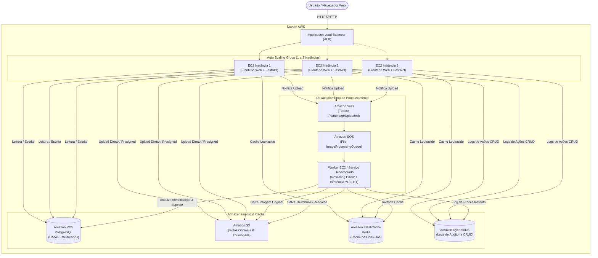
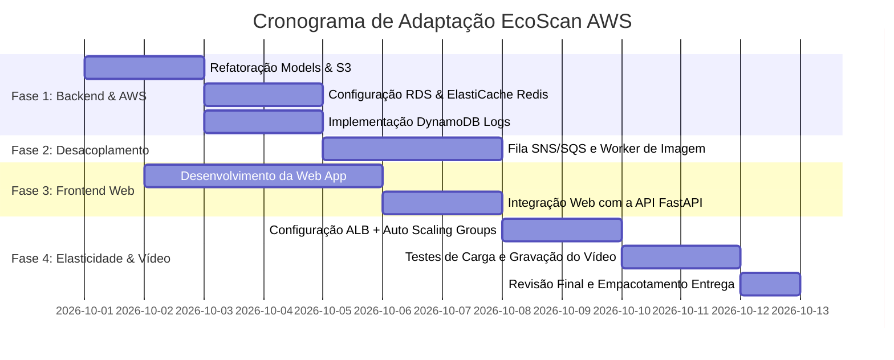

# Planejamento de Adaptação do EcoScan para a Nuvem AWS

**Disciplina:** Desenvolvimento de Software para Nuvem  
**Professores:** Dr. Paulo A. L. Rego e Dr. Fernando Antonio Mota Trinta  
**Projeto Base:** EcoScan (Transição de Mobile para Web + Arquitetura em Nuvem AWS)  
**Prazo de Entrega:** 10 de Outubro de 2026

---

## 1. Visão Geral e Alinhamento com a Especificação

O projeto **EcoScan** é originalmente uma aplicação de identificação de espécies de plantas e assistência botânica baseada em visão computacional (YOLO11), com API FastAPI, banco PostgreSQL e aplicativo móvel Flutter.

Para atender plenamente a todos os requisitos do Trabalho Prático 1, o projeto será adaptado em duas frentes fundamentais:
1. **Substituição da Interface:** Migração do aplicativo móvel (Flutter) para uma **Interface Web moderna e responsiva**, consumindo a API REST executada em instâncias EC2.
2. **Reestruturação Arquitetural na AWS:** Integração dos **6 serviços gerenciados da AWS** obrigatórios na Parte 1, além da configuração de **Alta Disponibilidade e Elasticidade (ALB + Auto Scaling)** exigida na Parte 2.

### Tabela de Cobertura de Requisitos e Penalidades

| Requisito do Trabalho | Serviço AWS | Implementação no EcoScan | Impacto se ausente |
| :--- | :--- | :--- | :--- |
| **Interface / Web Service** | **EC2** | Execução do Frontend Web e do Web Service (FastAPI) em instâncias EC2 | -1,0 ponto |
| **Banco Relacional** | **RDS (PostgreSQL)** | Armazenamento estruturado de usuários, histórico, catálogo de plantas e jardim pessoal | -1,5 ponto |
| **Armazenamento de Binários** | **S3** | Armazenamento das fotos de plantas enviadas e dos thumbnails gerados | -1,5 ponto |
| **Camada de Cache** | **ElastiCache (Redis)** | Cache de consultas frequentes (catálogo botânico, dados do jardim e histórico recente) | -1,5 ponto |
| **Auditoria NoSQL** | **DynamoDB** | Registro de auditoria de todas as operações CRUD (ação, dados, timestamp) | -1,5 ponto |
| **Desacoplamento Assíncrono** | **SNS / SQS** | Fila de processamento desacoplada para redimensionamento de imagens e inferência YOLO | -1,5 ponto |
| **Elasticidade Horizontal** | **ALB + Auto Scaling** | Distribuição de carga e escalonamento automático de 1 a 3 instâncias baseado em CPU | -1,5 ponto |

---

## 2. Nova Arquitetura na Nuvem AWS

### 2.1 Diagrama Arquitetural



---

## 3. Detalhamento da Adaptação dos 6 Serviços AWS

### 3.1. Amazon EC2 & Interface Web
* **Situação Atual:** A aplicação móvel em Flutter dependia de USB relay e APK Android para se comunicar com a API local.
* **Nova Implementação:**
  * Criação de uma **Interface Web responsiva** (SPA servida via Vite/React ou HTML5/Tailwind moderna).
  * Execução da API FastAPI e dos arquivos estáticos da Web em instâncias EC2 (`t2.micro` ou `t3.micro`).
  * Criação de uma AMI (Amazon Machine Image) ou script de *User Data* contendo Docker/Docker-Compose para inicialização automática em novas instâncias do Auto Scaling.

### 3.2. Amazon RDS (PostgreSQL)
* **Situação Atual:** PostgreSQL rodando em container Docker local (`postgres:15-alpine`). O modelo `Identification` salvava a foto binária diretamente na coluna `image_data: Mapped[bytes] = mapped_column(LargeBinary)`.
* **Nova Implementação:**
  * Provisionamento de uma instância **Amazon RDS PostgreSQL** (`db.t3.micro`).
  * **Refatoração do Modelo de Dados:**
    * Remoção da coluna binária `image_data` da tabela `identifications`.
    * Inclusão dos campos: `original_image_url` (S3), `thumbnail_image_url` (S3), e `processing_status` (`PENDING`, `PROCESSING`, `COMPLETED`, `FAILED`).
  * Atualização da variável de ambiente `DATABASE_URL` para o endpoint seguro do RDS.

### 3.3. Amazon S3 (Armazenamento Binário de Arquivos)
* **Situação Atual:** As imagens eram persistidas no próprio banco relacional como bytes ou guardadas temporariamente no app mobile.
* **Nova Implementação:**
  * Criação de um bucket S3 dedicado (ex: `ecoscan-plant-images-prod`).
  * Estrutura de prefixos no bucket:
    * `uploads/originals/{user_id}/{uuid}.jpg` — foto original enviada pelo usuário.
    * `processed/thumbnails/{user_id}/{uuid}_thumb.jpg` — versão redimensionada/otimizada gerada pelo worker.
  * Integração no backend via biblioteca `boto3` para upload seguro com geração de URLs públicas ou *Presigned URLs*.

### 3.4. Amazon ElastiCache (Redis)
* **Situação Atual:** Não existe camada de cache; toda consulta (histórico, listagem de plantas e guia de cuidados) bate diretamente no banco relacional.
* **Nova Implementação:**
  * Criação de um cluster **ElastiCache Redis** (modo nó único `cache.t2.micro` ou `cache.t3.micro`).
  * Padrão de Caching (*Cache-Aside*):
    * **Catálogo Botânico e Cuidados:** Dados quase estáticos de cuidados (sol, rega, poda, família) cacheados com TTL longo (ex: 24 horas).
    * **Meu Jardim (`/library`):** Cache da lista de plantas do usuário, invalidado apenas em operações de inclusão/remoção.
    * **Consultas de Espécies Frequentes:** Top plantas identificadas e detalhes botânicos.

### 3.5. Amazon DynamoDB (Log de Auditoria CRUD NoSQL)
* **Situação Atual:** As ações no banco relacional não possuem trilha de auditoria externa.
* **Nova Implementação:**
  * Criação de uma tabela no DynamoDB: `EcoScanAuditLogs`.
  * **Chave Primária:**
    * *Partition Key (PK):* `entity_type` (ex: `USER`, `IDENTIFICATION`, `PLANT_LIBRARY`).
    * *Sort Key (SK):* `timestamp_actionId` (ex: `2026-10-01T14:32:00Z#uuid`).
  * **Atributos Gravados em Toda Operação:**
    * `action_type`: `CREATE`, `READ`, `UPDATE`, `DELETE`.
    * `user_id`: UUID do usuário que realizou a ação.
    * `resource_id`: ID do registro afetado.
    * `manipulated_data`: JSON com os dados incluídos, alterados ou removidos.
    * `timestamp`: Data/hora exata em ISO-8601.
    * `client_ip` / `user_agent`: Metadados da requisição.
  * Implementação via Middleware/Interceptor no FastAPI para registrar automaticamente toda mutação.

### 3.6. Amazon SNS + SQS (Desacoplamento de Processamento de Arquivos)
* **Situação Atual:** A rota `/plants/identify` recebia o binário e executava o modelo YOLO11 diretamente na threadpool da API Web, bloqueando recursos de CPU do servidor web.
* **Nova Implementação (Totalmente Desacoplada):**
  1. O usuário faz o upload da foto pela interface Web.
  2. A API salva a imagem original no **S3**, insere o registro no **RDS** com status `PENDING` e publica um evento no **Amazon SNS** (`PlantImageUploadedTopic`).
  3. O **Amazon SQS** (`ImageProcessingQueue`) está subscrito ao tópico SNS e enfileira a tarefa.
  4. Um **Worker Desacoplado** (processo Python independente):
     * Consome a mensagem da fila SQS.
     * Baixa a imagem original do S3.
     * **Manipulação Obrigatória da Imagem:** Executa *rescaling* (redimensionamento para thumbnail web 300x300 e normalização 640x640 para visão computacional) utilizando Pillow/OpenCV.
     * Executa a inferência com o modelo YOLO11 (`best.pt`).
     * Faz upload do thumbnail gerado de volta para o S3.
     * Atualiza o registro no RDS (status `COMPLETED`, espécie detectada, confiança e URL do thumbnail).
     * Registra o log no DynamoDB e invalida o cache Redis.
  5. A interface Web visualiza o progresso em tempo real através de polling de status ou notificação.

---

## 4. Substituição do Mobile pelo Novo Frontend Web

Para atender a exigência de interface gráfica e a decisão de focar na Web, será desenvolvida uma aplicação Web amigável e moderna.

### 4.1. Módulos e Telas do Frontend Web

```
EcoScan Web App
├── 1. Autenticação & Perfil
│   ├── Login com JWT
│   ├── Cadastro de Novo Usuário
│   ├── Recuperação de Senha
│   └── Edição de Perfil
│
├── 2. Dashboard Principal
│   ├── Visão geral do Jardim e últimas identificações
│   ├── Estatísticas rápidas (total de plantas, espécies identificadas)
│   └── Ação rápida: Identificar Nova Planta
│
├── 3. Identificador de Plantas (Upload & Câmera)
│   ├── Upload via Drag-and-Drop ou captura via Webcam do notebook/PC
│   ├── Preview da imagem com recorte e opções
│   ├── Indicador de processamento assíncrono (aguardando SQS/Worker)
│   └── Tela de Resultado: Espécie reconhecida, nível de confiança, guia completo de cuidados e botão "Salvar no Meu Jardim"
│
├── 4. Meu Jardim (Jardim Pessoal - CRUD Completo)
│   ├── Listagem em grid com cartões visuais e fotos dos thumbnails do S3
│   ├── Detalhes da planta (rega, iluminação, solo, poda)
│   ├── Edição de apelido e anotações pessoais
│   └── Exclusão de planta do jardim
│
├── 5. Histórico de Identificações
│   ├── Linha do tempo de todas as fotos analisadas
│   ├── Filtros por data e espécie
│   └── Exclusão de itens do histórico
│
└── 6. Painel de Auditoria / Demonstração (Diferencial para a Apresentação)
    └── Visualização em tempo real dos logs gerados no DynamoDB (evidenciando a conformidade com o requisito 5 do trabalho)
```

### 4.2. Estratégia Tecnológica para o Frontend Web
* **Stack:** **React + Vite + Tailwind CSS** ou SPA moderna:
  * Rápida inicialização e empacotamento estático.
  * O build pode ser servido diretamente pelo Nginx na EC2 ou embutido como arquivos estáticos servidos pelo próprio FastAPI em `/static`.
  * Suporte nativo a Drag-and-Drop, câmera HTML5 (`navigator.mediaDevices.getUserMedia`) e consumo direto dos endpoints REST.

---

## 5. Parte 2: Elasticidade (Load Balancer e Auto Scaling)

### 5.1. Regras Definidas na Especificação
* **Estratégia:** Elasticidade horizontal com instâncias EC2 do tipo `t2.micro` ou `t3.micro`.
* **Topologia:**
  * Instância inicial: 1 instância.
  * Capacidade mínima: 1 instância.
  * Capacidade máxima: 3 instâncias.
* **Métrica de Scale-Out:**
  * Se a média de uso de CPU do ASG for **> 70% por mais de 1 minuto** $\rightarrow$ Adicionar 1 nova instância (até o máximo de 3).
* **Métrica de Scale-In:**
  * Se a média de uso de CPU do ASG for **< 25% por mais de 1 minuto** $\rightarrow$ Finalizar 1 instância (até o mínimo de 1).

### 5.2. Componentes da Infraestrutura de Elasticidade

1. **VPC e Subnets:**
   * Pelo menos 2 Subnets públicas em Zonas de Disponibilidade (AZs) distintas (ex: `us-east-1a` e `us-east-1b`) para o Application Load Balancer.
2. **Security Groups:**
   * `SG-ALB`: Permite tráfego HTTP/HTTPS na porta 80/443 de `0.0.0.0/0`.
   * `SG-EC2`: Permite tráfego na porta da aplicação (ex: 8000) **apenas vindo do SG-ALB**.
   * `SG-RDS`: Permite tráfego na porta 5432 apenas vindo do `SG-EC2`.
   * `SG-ElastiCache`: Permite tráfego na porta 6379 apenas vindo do `SG-EC2`.
3. **Launch Template (Modelo de Inicialização):**
   * AMI base (Ubuntu 22.04 LTS ou Amazon Linux 2023).
   * Script *User Data* para puxar a última versão do repositório/imagem Docker e subir os containers da aplicação web automaticamente na inicialização.
4. **Target Group & ALB:**
   * Health Check configurado na rota: `/plants/health` ou `/health` com intervalo de 15 segundos.
5. **Políticas de Escalonamento (CloudWatch Alarms):**
   * Alarme 1: `CPUUtilization > 70%` (período: 60s, avaliação: 1 ponto) $\rightarrow$ Ação de Step Scaling (+1 instância).
   * Alarme 2: `CPUUtilization < 25%` (período: 60s, avaliação: 1 ponto) $\rightarrow$ Ação de Step Scaling (-1 instância).

### 5.3. Preparação para a Gravação do Vídeo de Demonstração
A especificação exige a entrega de um link de vídeo mostrando a Parte 2 funcionando.
* **Ferramenta de Teste de Carga:** Uso de script com `Locust`, `k6` ou comando utilitário Linux `stress-ng`:
  * Rota `/stress` na API para consumir CPU temporariamente de forma controlada OU geração de requisições concorrentes no ALB via Locust.
* **Roteiro do Vídeo (3 a 5 minutos):**
  1. Mostrar o console AWS com 1 instância EC2 ativa no ASG e ALB saudável.
  2. Disparar a ferramenta de carga contra a URL do Load Balancer.
  3. Mostrar no gráfico do CloudWatch a CPU ultrapassando 70% por 1 minuto.
  4. Exibir o Auto Scaling acionando e provisionando a 2ª (e 3ª) instância EC2.
  5. Mostrar o tráfego sendo balanceado entre as instâncias pelo ALB.
  6. Cessar a carga e mostrar a CPU caindo abaixo de 25%.
  7. Exibir o Auto Scaling finalizando as instâncias extras e retornando à capacidade mínima (1 instância).

---

## 6. Plano de Ação Passo a Passo (Sprints de Execução)



### Detalhamento das Etapas:

#### Etapa 1: Refatoração do Banco e Armazenamento (RDS + S3)
1. Criar módulo `api/ecoscan/aws/s3.py` com rotas de upload e leitura de URLs do S3.
2. Alterar o model SQLAlchemy em `api/ecoscan/models.py` para remover `image_data: LargeBinary` e adotar URLs do S3.
3. Criar migration Alembic para atualizar o schema no RDS PostgreSQL.

#### Etapa 2: Cache com ElastiCache (Redis)
1. Criar helper `api/ecoscan/aws/cache.py` utilizando `redis-py` assíncrono.
2. Adicionar caching nos endpoints:
   * Detalhes botânicos (`plantCareCatalog`).
   * Listagem do jardim (`/library`).
   * Histórico de identificações (`/history`).

#### Etapa 3: Auditoria NoSQL com DynamoDB
1. Criar helper `api/ecoscan/aws/dynamo.py` usando `boto3`.
2. Criar função de auditoria chamada nas operações de CRUD:
   * Criação/edição de usuário (`/users`).
   * Registro e exclusão de identificação (`/history`).
   * Inclusão e remoção de plantas no jardim (`/library`).

#### Etapa 4: Desacoplamento SNS/SQS + Worker de Imagens
1. Criar módulo `api/ecoscan/aws/messaging.py` para publicação no SNS.
2. Criar script de worker `api/ecoscan/worker.py`:
   * Escuta mensagens da fila SQS.
   * Baixa foto do S3, faz o *rescaling* (redimensionamento Pillow) e thumbnail.
   * Executa a predição com o modelo YOLO11 (`plant_classifier.py`).
   * Atualiza status e metadados no RDS.

#### Etapa 5: Frontend Web
1. Criar diretório `web/` com template limpo e moderno.
2. Implementar fluxo completo: Login/Cadastro $\rightarrow$ Upload de Imagem de Planta $\rightarrow$ Visualização do Resultado $\rightarrow$ Adicionar ao Meu Jardim $\rightarrow$ Histórico.

#### Etapa 6: Infraestrutura AWS, ALB e Auto Scaling
1. Criar o Launch Template com User Data instalando Docker e rodando os containers.
2. Configurar o Application Load Balancer e Target Group.
3. Configurar Auto Scaling Group (min: 1, max: 3) com políticas de CPU (> 70% e < 25%).
4. Executar script de teste de carga e gravar o vídeo da Parte 2.

---

## 7. Checklist Final de Entrega

- [ ] **EC2:** Aplicação web e API rodando perfeitamente em instâncias EC2.
- [ ] **RDS:** Dados estruturados no RDS PostgreSQL (sem binários pesados no banco).
- [ ] **S3:** Imagens originais e thumbnails armazenadas em bucket S3.
- [ ] **ElastiCache:** Redis ativo e acelerando consultas frequentes.
- [ ] **DynamoDB:** Todas as ações do CRUD gerando logs com ação, dados e hora.
- [ ] **SNS/SQS:** Processamento de imagens (rescaling + IA) 100% desacoplado via mensageria.
- [ ] **Interface Web:** Interface Web funcional, intuitiva e conectada à API.
- [ ] **Load Balancer (ALB):** Distribuindo tráfego entre instâncias de forma transparente.
- [ ] **Auto Scaling:** Escalando de 1 a 3 instâncias com base nas regras de CPU estabelecidas.
- [ ] **Vídeo Demonstrativo:** Vídeo publicado no YouTube/Drive comprovando o Auto Scaling em funcionamento sob estresse.
- [ ] **Código Fonte:** Repositório Git limpo ou arquivo `.zip` pronto para envio até 10/10/2026.
